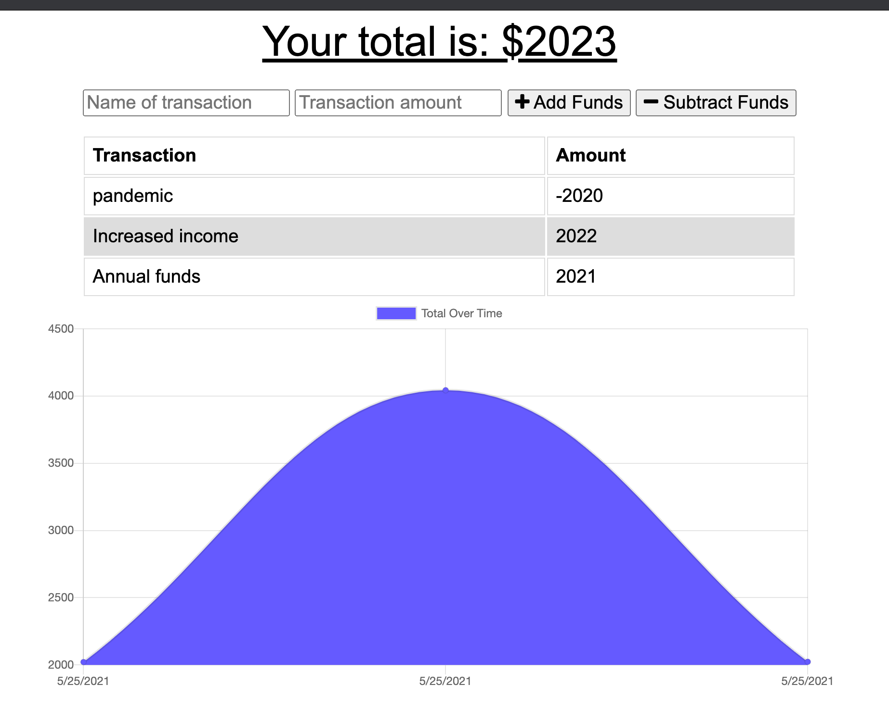
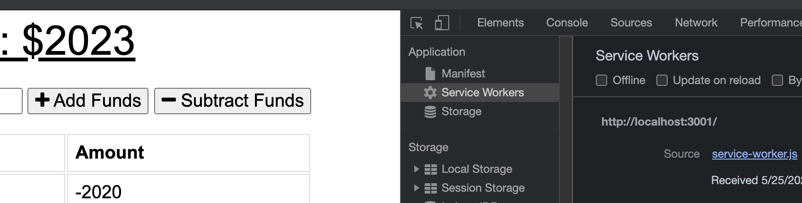
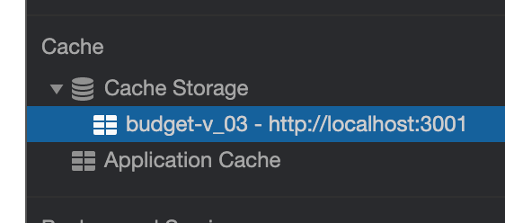

# Budget Tracker PWA by HLRY

## Table of Contents
* [Description](#Description)
* [Installation](#Installation)
* [Usage](#Usage)
* [LICENSE](#LICENSE)
* [CONTRIBUTING](#CONTRIBUTING)
* [Images](#Images)
* [Questions](#Questions)

## Description
A progressive web app for tracking your budget even when your internet and/or data connection is unstable. Ideal for the budget-conscious traveler!

## Installation

Make sure that you have Node and MongoDB installed on your local computer. You can make a free MongoDB account for personal use on the MongoDB website. The [Node.js project documentation](https://nodejs.org/en/download/) provides instructions on installation options.

Clone this repository onto your local computer and navigate into the project using your command line interface (CLI -- such as bash or terminal).

To install the mongoose and express node dependencies, run the following command:

npm install mongoose express

That's it!

## Usage
View the [deployed webapp on Heroku](https://shielded-lake-93004.herokuapp.com/).

## LICENSE
This app is made available under the permissive open source license: the ISC License. 

## CONTRIBUTING

This project is not accepting contributions but if you send a pull request, it could be accepted under the terms of the [ISC license](https://opensource.org/licenses/ISC).

## Images
Deployed Webapp:

Service worker in developer tools:

Local host cache in developer tools:

## Questions
If you have questions contact me on GitHub at [hlry](https://github.com/hlry).

